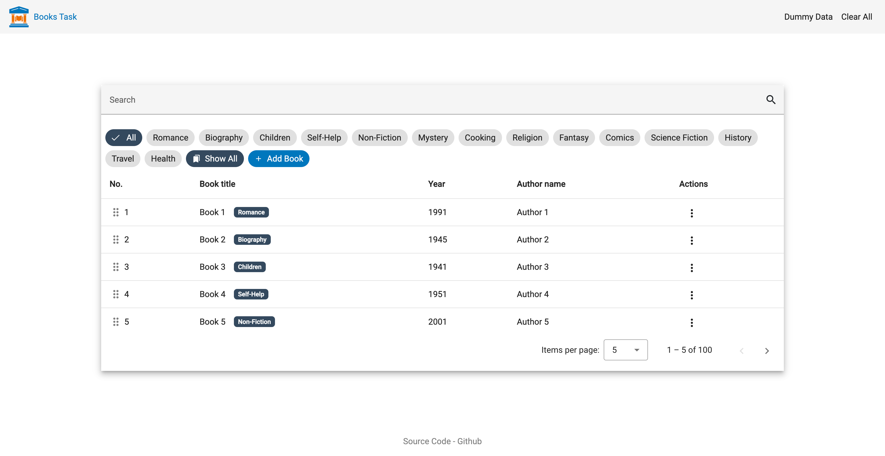
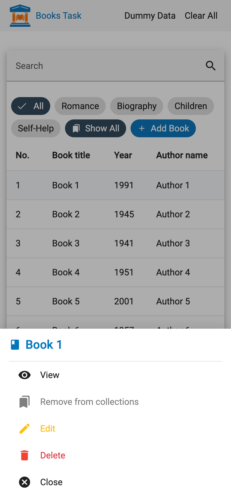
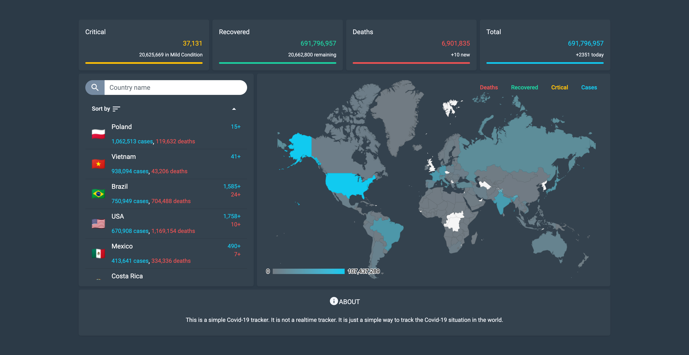

# BooksTask

This project was generated with [Angular CLI](https://github.com/angular/angular-cli) version 16.1.4.

## Live Demo
[https://abdallahr99.github.io/books-task/](https://abdallahr99.github.io/books-task/)

 
  
  
  

<!---->
<!---->

## Development server

Run `ng serve` for a dev server. Navigate to `http://localhost:4200/`. The application will automatically reload if you change any of the source files.

## Code scaffolding

Run `ng generate component component-name` to generate a new component. You can also use `ng generate directive|pipe|service|class|guard|interface|enum|module`.

## Build

Run `ng build` to build the project. The build artifacts will be stored in the `dist/` directory.

## Running unit tests

Run `ng test` to execute the unit tests via [Karma](https://karma-runner.github.io).

## Further help

To get more help on the Angular CLI use `ng help` or go check out the [Angular CLI Overview and Command Reference](https://angular.io/cli) page.

## Install with Yarn ( Recommended )

Install Corepack
The preferred way to manage Yarn is through Corepack, a new binary shipped with all Node.js releases starting from 16.10. It acts as an intermediary between you and Yarn, and lets you use different package manager versions across multiple projects without having to check-in the Yarn binary anymore.

Node.js >=16.10
Corepack is included by default with all Node.js installs, but is currently opt-in. To enable it, run the following command:

`corepack enable`

Node.js <16.10
Corepack isn't included with Node.js in versions before the 16.10; to address that, run:

`npm i -g corepack`.

Then run `yarn install` to download the node packages

## Also

You can review some of the other tasks that I have done recently.

CovidTracker: [https://github.com/AbdallahR99/covidtracker](https://github.com/AbdallahR99/covidtracker)
[Live Demo](https://abdallahr99.github.io/covidtracker/)

A simple UI task (check the code): [https://github.com/AbdallahR99/ng_task](https://github.com/AbdallahR99/ng_task) [Live Demo](https://abdallahr99.github.io/ng_task/)

